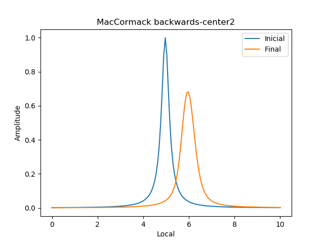
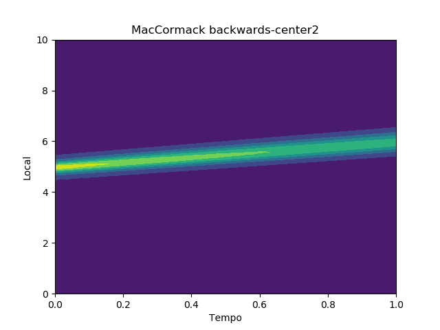
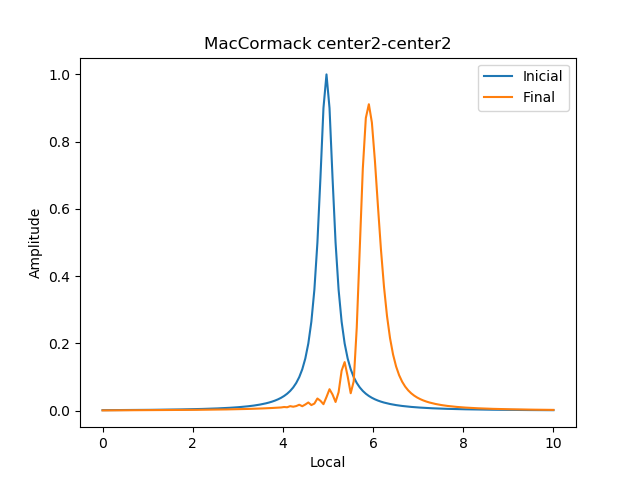
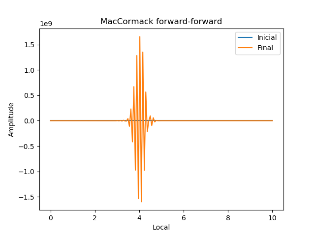
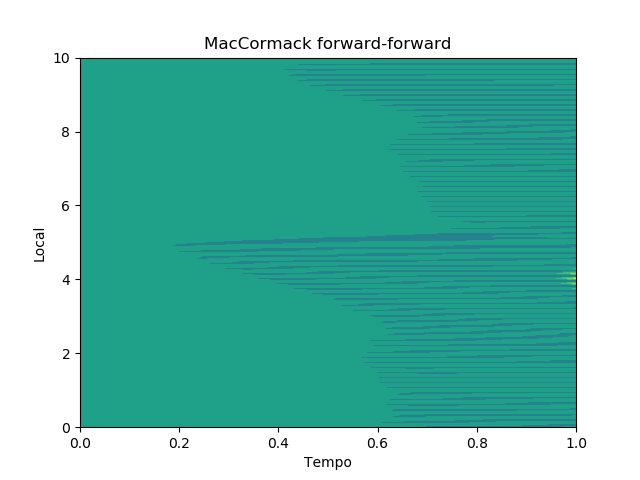
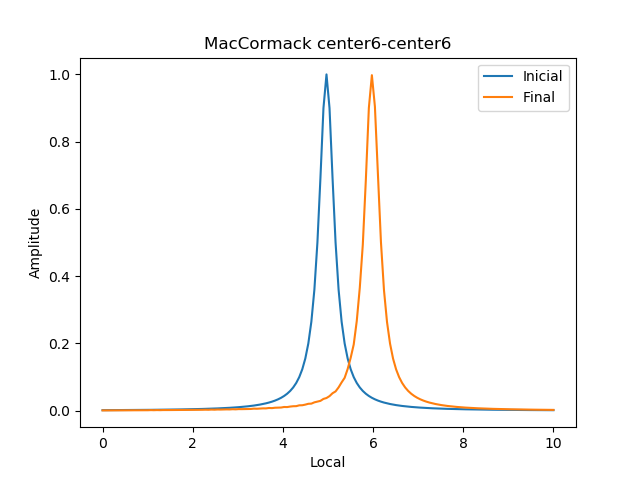
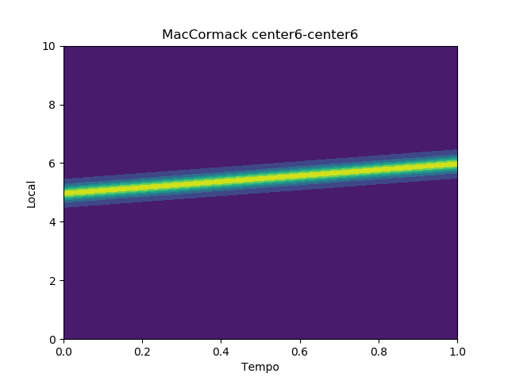

## Problema 0: Propagação de onda

# Descrição

Propagação de onda de pressão unidimensional à velocidade unitária.

# Formulação

Mais detalhes sobre o equacionamento ver Documentação. A discretização foi realizada por métodos de diferenças finitas.

# Discretização

**Métodos assimétricos:**

Somente foram implementados métodos assimétricos de baixa ordem:
 * Backward;
 * Forward.

**Métodos simétricos:**

| Método           | Ordem |
|------------------|-------|
|Centrado 2 pontos | *O(2)*|
|Centrado 4 pontos | *O(4)*|
|Compacto 3-5      | *O(6)*|
|Compacto 3-7      | *O(8)*|
|Compacto 5-7      | *O(10)*|

**Métodos de segunda derivada:**

| Método           | Ordem |
|------------------|-------|
|Centrado 2 pontos | *O(2)*|
|Centrado 4 pontos | *O(4)*|
|Compacto 3-5      | *O(4)*|
|Compacto 3-5      | *O(6)*|
|Compacto 3-7      | *O(8)*|
|Compacto 5-7      | *O(10)*|

# Método de integração

Foram implementados os métodos de integração explícita:

 - Euler;
 - MacCormack;
 - Lax-Wendroff;
 - Leap Frog;
 - Adams-Bashfort 2;
 - Adams-Bashfort 3;
 - Adams-Bashfort-Moulton 3;
 - Burstein;
 - Gazdag;
 - Runge-Kutta de 4a ordem.

Os métodos de integração implícita não foram implementados com a possibilidade de utilizar esquemas de discretização compactos. É possível somente utilizar os métodos backward, forward e centrado de 2 pontos, com exceção do Adams-Moulton, que possui um passo explícito que permite o uso dos esquemas de discretização compactos. Os métodos de integração implícita implementados foram:

 - Euler;
 - Trapezoidal;
 - Adams-Moulton 3.

# Códigos

O código foi gerado utilizando o módulo f2py. O solver é chamado pelo script em python "Main.py". Os módulos são gerados utilizando linguagem Fortran 90.

Foram criados dois módulos: Solvers e SolversImp, contendo os métodos de integração explícitos e implícitos, respectivamente.

A discretização é realizada pelos módulos DiffSchemes e Diff2Schemes.

Todas as funções funcionam da seguinte maneira:

```
P = func(L,v,Ploc,dt,nt,nc,odf)
```

Sendo:
 - P: _real (nc,nt)_ tensor da informação resolvido, contendo posições nas linhas e isotemporais nas colunas;
 - L: _real_ Comprimento do domínio;
 - v: _real_ velocidade de propagação da informação;
 - Ploc: _real_ Localização inicial da onda;
 - dt: _real_ passo de tempo;
 - nt: _inteiro_ quantidade de passos no tempo;
 - nc: _inteiro_ quantidade de pontos no espaço;
 - odf: _inteiro_ esquema de discretização utilizado de acordo com a ordem, dependendo do método pode possuir mais de um.

**Módulo Solver**

```
P = eulerexp(args)
```
Método de integração: Euler explícito;
Quantidade de discretizadores: 1.

```
P = maccormack(args)
```
Método de integração: MacCormack;
Quantidade de discretizadores: 2.

```
P = laxwendroff(args)
```
Método de integração: Lax-Wendroff;
Quantidade de discretizadores: 2.

```
P = leapfrog(args)
```
Método de integração: Leap Frog;
Quantidade de discretizadores: 1.
```
P = ab2(args)
```
Método de integração: Adams-Bashfort 2;
Quantidade de discretizadores: 1.
```
P = ab3(args)
```
Método de integração: Adams-Bashfort 3;
Quantidade de discretizadores: 1.
```
P = abm3(args)
```
Método de integração: Adams-Bashfort-Moulton 3;
Quantidade de discretizadores: 2.
```
P = burstein(args)
```
Método de integração: Burstein;
Quantidade de discretizadores: 1.
```
P = gazdag(args)
```
Método de integração: Gazdag;
Quantidade de discretizadores: 1.
```
P = rk4(args)
```
Método de integração: Runge-Kutta de 4a ordem;
Quantidade de discretizadores: 4.

**Módulo SolverImp**

```
P = eulerimp(args)
```
Método de integração: Euler implícito;
Quantidade de discretizadores: 1.
```
P = trapezoidal(args)
```
Método de integração: Trapezoidal;
Quantidade de discretizadores: 2.
```
P = abm3(args)
```
Método de integração: Adams-Bashfort-Moulton 3;
Quantidade de discretizadores: 2.

_Código dos discretizadores:_

| Método           | Código |
|------------------|--------|
|Backward          | -1     |
|Forward           |  1     |
|Centrado 2 pontos |  2     |
|Centrado 4 pontos |  4     |
|Compacto 3-5      |  6     |
|Compacto 3-7      |  8     |
|Compacto 5-7      | 10     |

**Módulo DiffSchemes**

Para a discretização, as funções funcionam da seguinte maneira:

```
g = func(f,h,n)
```

Onde:
 - g: _real (n)_ vetor discretizado;
 - f: _real (n)_ vetor a ser discretizado;
 - h: _real_ passo da discretização;
 - n: _inteiro_ quantidade de pontos.

Backward:
```
g = backward_d1(args)
```
Forward:
```
g = forward_d1(args)
```
Centrada de 2 pontos:
```
g = center2_d1(args)
```
Centrada de 4 pontos:
```
g = center4_d1(args)
```
Compacta 3-5:
```
g = thomas6_d1(args)
```
Compacta 3-7:
```
g = thomas8_d1(args)
```
Compacta 5-7:
```
g = thomas10_d1(args)
```

**Módulo Diff2Schemes**

Funcionam de forma semelhante aos esquemas de primeira derivada. Funções:

Centrada de 2 pontos:
```
g = center2_d2(args)
```
Centrada de 4 pontos:
```
g = center4_d2(args)
```
Compacta 3-5 (baixa ordem):
```
g = thomas4_d1(args)
```
Compacta 3-5:
```
g = thomas6_d1(args)
```
Compacta 5-5:
```
g = thomas8_d2(args)
```
Compacta 5-7:
```
g = thomas10_d2(args)
```

# Resultados e desempenho

O problema de advecção 1D pode apresentar dois problemas:

1. Dissipação (D), o qual pode ser verificado com a redução da amplitude da onda.





2. Espuricidade (E), que pode ser verificado pelo surgimento de ondas de alta frequência na jusante da onda.




Em alguns casos, pode-se inclusive alcançar a divergência do modelo (Div).





A onda utilizada nos testes foi de função 1/(1 + 25x²).





**Desempenho numérico dos métodos:**

|                            | B | F | C2 | C4 | C6 | C8 | C10 |
|----------------------------|---|---|----|----|----|----|-----|
| Euler explícito            | D |Div| E  | E  | E  | E  | E   |
| MacCormack                 | D |Div| E  | E  |Conv|Conv| Conv|
| Lax-Wendroff               | D |Div| Div| Div| Div| Div| Div |
| Leap Frog                  | D |Div| E  | E  | Div| Div| Div |
| Adams-Bashfort 2           | D |Div| E+D| E+D|Conv|Conv|Conv |
| Adams-Bashfort 3           | D |Div| E+D| E+D|Conv|Conv|Conv |
| Adams-Bashfort-Moulton 3   | D |Div| E+D| E+D|Conv|Conv|Conv |
| Burstein                   | D |Div| E  | E  | E  | E  | E   |
| Gazdag                     | D |Div| E+D| E+D|Conv|Conv|Conv |
| Runge-Kutta de 4a ordem    | D |Div| E+D| E+D|Conv|Conv|Conv |
| Euler implícito            | D |Div| E+D| -  | -  | -  | -   |
| Trapezoidal                | D |Div| E+D| -  | -  | -  | -   |
| Adams-Moulton 3            | D |Div| E+D| -  | -  | -  | -   |

Obs. 1: A convergência depende da direção da propagação da onda, se s onda estivesse se deslocando no sentido contrário, a discretização forward teria convergido enquando a backward teria divergido.

Obs. 2: Os casos de divergência poderia ter sido corrigidos com o uso de um filtro, porém o objetivo aqui é estudar o comportamento dos métodos, foi optado por manter o resultado sem a utilização de filtros.

Salienta-se que métodos que envolvem múltiplos passos, como os preditores-corretores permitem combinar diferentes formas de discretização. Por exemplo, o Adams-Bashfort-Moulton alcança a convergência com os esquemas compactos de 6a ordem em todos os passos em 0.408 ms, enquanto que combinando um esquema compacto de 10a ordem no passo preditor e um esquema centrado de 4 pontos no passo corretor convergiu dentro de 0.382 ms.

**Desempenho computacional dos métodos de discretização:**

Os testes de desempenho foram realizados em um computador com Debian 9, processador Intel i5 2500 (3.7 GHz). A malha utilizada possuía 150 pontos por 100 passos no tempo.

Utilizando integração Euler Explícito:

| Método           | Tempo [ms] |
|------------------|------------|
| Backward         | 0.034      |
| Forward          | 0.033      |
| Centrado 2       | 0.034      |
| Centrado 4       | 0.087      |
| Compacto 3-5     | 0.193      |
| Compacto 3-7     | 0.205      |
| Compacto 5-7     | 0.269      |


**Desempenho computacional dos métodos de integração:**

Utilizando discretização centrada de 2 pontos:

| Método                     | Tempo [ms] |
|----------------------------|------------|
| Euler explícito            | 0.034      |
| MacCormack                 | 0.066      |
| Lax-Wendroff               | 0.056      |
| Leap Frog                  | 0.032      |
| Adams-Bashfort 2           | 0.041      |
| Adams-Bashfort 3           | 0.040      |
| Adams-Bashfort-Moulton 3   | 0.072      |
| Burstein                   | 0.053      |
| Gazdag                     | 0.042      |
| Runge-Kutta de 4a ordem    | 0.099      |
| Euler implícito            | 0.138      |
| Trapezoidal                | 0.172      |
| Adams-Moulton 3            | 0.197      |
